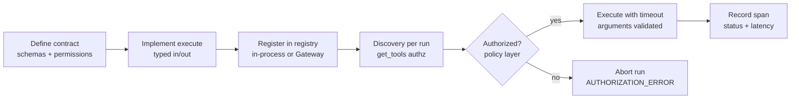

# Via Agent Harness

Via's agent runtime is **harness we own**, not a framework we embed. This
document explains why, what the harness is responsible for, and how local
development maps to the production AWS deployment.

---

## 1. Why Via does not depend on LangChain

LangChain, LangGraph, LlamaIndex and CrewAI are excellent exploration tools.
They are also fast-moving frameworks whose abstractions (chains, retrievers,
runnables, message stores) sit _between_ our application logic and the model
provider. For Via that dependency would mean:

- **Business logic coupled to framework churn.** Upgrading the framework
  becomes a migration of domain code.
- **Hidden control flow.** Framework loops, memory managers and retrievers
  make decisions Via must own for authorization and auditability reasons:
  _every_ tool call must pass an explicit permission check, with no framework
  code path able to bypass it.
- **Observability gaps.** Tracing via framework callbacks is best-effort;
  Via needs a closed set of spans it fully controls.

The absence of an agent framework is intentional. If a concrete requirement
ever appears that cannot be reasonably implemented through our interfaces
plus AWS capabilities, the decision can be revisited - deliberately, in the
open, as an architectural change.

## 2. What the harness is responsible for

Everything below lives in `backend/agent/harness` (`via_harness`) behind ports:

| #   | Responsibility             | Where                        | Port / implementation                        |
| --- | -------------------------- | ---------------------------- | -------------------------------------------- |
| 1   | Agent invocation           | `runner.py`                  | `AgentRunner.execute()`                      |
| 2   | Session/request identity   | `context.py`                 | `RunContext`, `SessionContext`               |
| 3   | Prompt resolution          | `prompts/base.py`            | `PromptResolver`                             |
| 4   | Tool discovery             | `tools/registry.py`          | `ToolRegistry.get_tools(authz)`              |
| 5   | Tool authorization         | `policy.py`                  | `Authorizer`, `AuthorizationContext`         |
| 6   | Tool invocation            | `tools/executor.py`          | `ToolExecutor` (validation + timeout)        |
| 7   | Context management         | `runner.py`                  | single-run conversation assembly             |
| 8   | Error handling             | `errors.py`                  | `ErrorCategory` taxonomy, never swallowed    |
| 9   | Timeouts                   | executor + runner            | per-tool contract deadline, per-model budget |
| 10  | Retry policy               | `model/bedrock.py`           | transient-only retries with backoff          |
| 11  | Structured outputs         | `response.py`                | strict JSON wire contract validation         |
| 12  | Tracing                    | `tracing.py` + observability | OTel-compatible spans                        |
| 13  | Metrics                    | `tracing.py`                 | `MetricsSink` counters                       |
| 14  | Cost/usage telemetry       | `runner.py`                  | token usage aggregation per run              |
| 15  | Model/provider abstraction | `model/base.py`              | `ModelClient.invoke/stream`                  |

## 3. What AWS AgentCore provides

Amazon Bedrock AgentCore is AWS's managed runtime surface for agents:

- **AgentCore Harness** - managed execution of agent loops against Bedrock models.
- **AgentCore Gateway** - managed tool endpoint discovery/invocation (MCP-style).
- **AgentCore Observability** - managed trace/metric collection for agent runs.
- **Bedrock Prompt Management** - versioned prompt storage and resolution.
- **Agent Registry** - catalog of available agents (later).

These are _implementations of our ports_, not replacements for them.

## 4. What Via owns

Via owns, permanently, regardless of backend:

1. The **ports** (`ModelClient`, `PromptResolver`, `ToolRegistry`,
   `ToolExecutor`, `Authorizer`, `Tracer`, `MetricsSink`) defined in
   `via_harness`.
2. The **tool contract** - name, version, description, input/output schemas,
   required permissions, timeout, owner (`tools/base.py::ToolContract`).
3. The **authorization rule**: no tool executes unless the caller holds the
   contract's permissions _and_ owns the target video. Denial aborts the run;
   the model never sees denial feedback it could reason around.
4. The **wire contract** between model output and the application
   (`response.py`): one JSON object per turn, either a `tool_request` or a
   validated `final` payload with citations scoped to the authorized video.
5. Domain tools themselves (`backend/agent/tools`): `get_video_metadata`,
   `get_transcript`, `analyze_video`.

## 5. Tool lifecycle



Adding a tool = new class in `backend/agent/tools/implementations/` with a
`ToolContract`, registered in `build_default_registry`. Nothing else changes.

## 6. Prompt lifecycle

Prompts are immutable `(name, version, environment)` triples:

1. **Author** edits YAML under `backend/agent/prompts/src/via_prompts/prompts/<name>/v<N>.yaml`.
2. **Resolve** at run time through `PromptResolver`; the resolved version is
   stamped onto every trace.
3. **Render** validates declared variables; missing/unexpected variables fail
   fast (`INVALID_REQUEST`).
4. **Publish to production** = upload the same content into Amazon Bedrock
   Prompt Management and point `PromptResolver` at it. Content files remain
   the source of truth.

## 7. Observability lifecycle

Every invocation produces exactly one trace:

```
agent.run                     root: user/video/agent_version/prompt/usage
├── prompt.resolve            prompt name/version/environment
├── model.invoke              model id, step, tokens
├── tool.invoke               tool name/version/owner/status/latency
│   └── (per requested tool)
└── response.validate         final JSON validation result
```

Spans are OpenTelemetry-compatible records (`trace_id` 32-hex, `span_id`
16-hex, parent linkage, duration, structured attributes). Locally they are
kept in-memory by `LocalTracer` and emitted as structured logs
(`GET /agent/runs/{run_id}/trace` exposes them for debugging). In production,
the same records flow to **AgentCore Observability / CloudWatch** via an
exporter implementing the `Tracer` port - no business-code changes.

Errors are always recorded on the failing span _and_ the root span with their
`ErrorCategory`, so a failed run is diagnosable from traces alone.

## 8. Authentication vs authorization

| Question                                        | Answered by                | Mechanism                                                                                                                                  |
| ----------------------------------------------- | -------------------------- | ------------------------------------------------------------------------------------------------------------------------------------------ |
| "Who is this user?"                             | Application identity layer | v0.1: `X-User-Id` header; production: real auth (IAM / Cognito / OIDC)                                                                     |
| "Can this user invoke this tool on this video?" | Harness policy layer       | `AuthorizationContext(user_id, video_id, permissions)` + `DefaultAuthorizer` (permission coverage **and** DynamoDB-backed ownership check) |

The harness receives authentication as a fact and enforces authorization as a
gate. It cannot be tricked into acting on a video outside the caller's scope:
citations are validated against the authorized video id too.

## 9. Local vs production implementations

| Port                 | Local (default)                                | Production                                              |
| -------------------- | ---------------------------------------------- | ------------------------------------------------------- |
| `ModelClient`        | `LocalModelClient` (deterministic, scriptable) | `BedrockConverseClient` → TwelveLabs Pegasus on Bedrock |
| `PromptResolver`     | `FilePromptResolver` (YAML files)              | Amazon Bedrock Prompt Management                        |
| `ToolRegistry`       | `InProcessToolRegistry`                        | Amazon Bedrock AgentCore Gateway adapter                |
| `Tracer`             | `LocalTracer` (memory + structured logs)       | AgentCore Observability / CloudWatch exporter           |
| `VideoAccessChecker` | same                                           | same (DynamoDB ownership lookup)                        |

Selection happens in one place only: `backend/agent/service/wiring.py`. Everything
above `AgentRunner.execute()` is identical everywhere.

## 10. How a new tool is added

1. Create `backend/agent/tools/src/via_tools/implementations/<name>.py`:

```python
class MyInput(BaseModel):
    """Arguments."""

    topic: str = Field(min_length=1)


class MyOutput(BaseModel):
    """Result shape."""

    summary: str


class MyTool:
    contract = ToolContract(
        name="my_tool",
        description="One sentence shown to the model.",
        input_model=MyInput,
        output_model=MyOutput,
        required_permissions=frozenset({Permission.VIDEO_READ}),
        timeout_seconds=5.0,
        owner="via-agent-platform",
    )

    def execute(
        self, *, video_id, authz, arguments
    ) -> ToolResult: ...  # video_id comes from the AUTHORIZED context, not the model
```

2. Register it in `via_tools.registry.build_default_registry`.
3. Add unit tests (contract validity, permission filtering, execution).
4. Done - discovery, authorization, timeouts, tracing and error handling are
   inherited from the harness automatically.

## Deferred AWS integrations (v0.2+)

Deliberately not wired yet; seams exist so each is a drop-in adapter:

- Actual Pegasus/Transcribe calls (`processing.py` interfaces raise
  `NotImplementedError`; worker marks videos `FAILED` when enabled).
- Bedrock Prompt Management resolver (stub raises with roadmap pointer).
- AgentCore Gateway registry adapter (protocol already matches).
- Agent Registry (no second agent exists).
- OpenTelemetry SDK exporter for spans (records already OTel-shaped).
