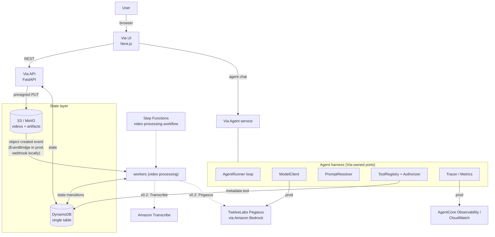

# Via Architecture

Via is a video intelligence application: a user uploads a video, waits for
processing, then converses with an AI agent that understands it.

## System overview



Detailed agent runtime design: [agent-harness.md](agent-harness.md).
Local development walkthrough: [local-development.md](local-development.md).
API reference: [api.md](api.md).

## Request flows

### Upload & processing

1. `POST /videos` creates the record with status `UPLOADING` and returns
   `202 Accepted` carrying the opaque `video_id` (and, when configured, a
   presigned PUT target — see Slice #1).
2. The client uploads bytes directly to storage - the API never proxies media.
3. An object-created event reaches the worker (EventBridge in production,
   MinIO webhook locally). Both are normalized onto one internal envelope.
4. The worker validates ownership of the event, moves the video
   `UPLOADING → PROCESSING`, runs (future) Transcribe/Pegasus hooks, and
   finishes at `PROCESSED` or `FAILED`.

### Agent interaction

1. `POST /agent/invoke` authenticates the user, builds an
   `AuthorizationContext`, and hands off to the harness `AgentRunner`.
2. The runner resolves the prompt version, discovers tools permitted for the
   context, and invokes the model through the `ModelClient` port.
3. Tool requests are authorized (permissions + video ownership) before
   execution; results feed back to the model within a step budget.
4. The final answer must satisfy the strict JSON response contract including
   citations scoped to the authorized video.
5. A complete trace (root + child spans) is recorded for every run.

## Status lifecycle

```
UPLOADING ──▶ PROCESSING ──▶ PROCESSED ──▶ DELETED
     │             │
     │             ▼
     ├──▶ FAILED ◀─┘          (FAILED → DELETED allowed)
     └────────────────────────▶ DELETED
```

Transitions are enforced by an explicit table in `backend/db`; anything not
listed raises `InvalidTransition`. Slice #1 only writes the initial
`UPLOADING`; the remaining transitions land with the worker.

## Data model

Single DynamoDB table `via-table` contract (`pk`/`sk`, GSI `gsi1`):

| PK           | SK     | Content             |
| ------------ | ------ | ------------------- |
| `VIDEO#<id>` | `META` | current video state |

GSI `gsi1` (`USER#<user_id>` → `<created_at>#<video_id>`) supports `GET /videos` for the authenticated user without a table Scan.
Slice #1 also stores the V0 `file_size`/`content_type` (when declared) and the
placeholder `s3_key` on the `META` item.

## Vertical slices

- **Slice #1 — `POST /videos` (this repo):** validates the request, enforces
  `content_type` allow-list and `max_videos_per_user` quota (409), generates
  `video_id`, creates the `META` item with `attribute_not_exists(pk)`, sets
  `UPLOADING`, returns `202 {video_id, status}` (plus `upload` when presigning
  is enabled). Contract documented at [docs/architecture/api-contract.md](architecture/api-contract.md).
  Deferred: S3 bytes, events, Step Functions, transcription, workers, agent.

## Architectural decisions

| Decision                                        | Rationale                                                                                                            |
| ----------------------------------------------- | -------------------------------------------------------------------------------------------------------------------- |
| Via-owned agent harness                         | Authorization, tracing and structured outputs must be under our control; framework churn must not reach domain code. |
| No LangChain/LangGraph/RAG/embeddings/vector DB | Not required by the product; TwelveLabs Pegasus provides native video understanding.                                 |
| Direct browser→S3 uploads                       | API stays stateless and cheap; presigned URLs expire quickly.                                                        |
| Single DynamoDB table                           | One resource to manage/secure; explicit typed entities avoid generic-entity mush.                                    |
| EventBridge-shaped events everywhere            | Identical handler code locally and in production; no divergent mock pipeline.                                        |
| Step Functions for the processing workflow      | Durable retries/polling for long-running media jobs without hand-rolled queues.                                      |
| uv + npm workspaces monorepo                    | Atomic cross-package changes, single lockfiles, fast CI.                                                             |
| OpenTelemetry-compatible traces from day one    | Production observability becomes an exporter swap, not a rewrite.                                                    |

## Explicit non-goals (v0.1)

Kubernetes/OpenSearch/vector databases/RAG/multi-agent orchestration/
autonomous background agents/long-term memory. See `docs/agent-harness.md`
for deferred AWS integrations and their seams.
